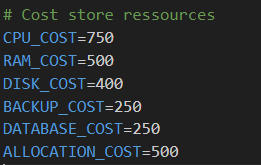

# Get Started

Documentation for the Hostactyl Dashboard


## Ubuntu and Debian

Firstly, make sure that you have all the prerequisites above installed (if you do you can skip this part).


**Installation**

````md
sudo apt update && apt upgrade -y

sudo apt install git

npm install p2

git clone https://github.com/HostactylDevelopment/HostactylForPterodactylv1.git

cd HostactylForPterodactylv1

npm install
````

## ENV CUSTOMIZE
go to .env file

Change  to your actual client id and secret

add ````http://localhost:3000/callback/discord```` to your bot redirect


change PTERODACTYL_URL to your panel url and PTERODACTYL_KEY to api key


Change email to your email address to get admin


Change price of the Resources


Change Name and Favicon Icon


## RUNNING

Below, Command to start 1 time

````md
node .
````

Below, Command to start 24/7

````md
pm2 start index.js
````

Head over to the url to get your dashboard
## More

Congratulations! You have now installed Hostactyl. Let's get the dashboard to Custom [Domain](/domain.md)
