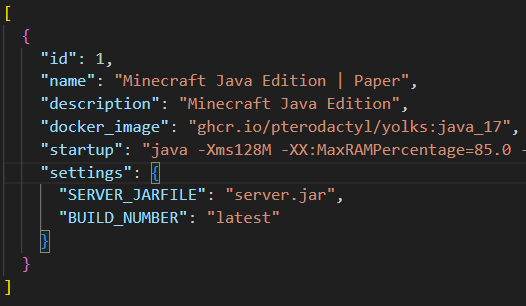
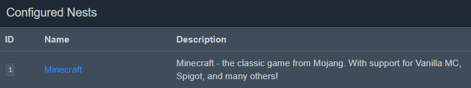
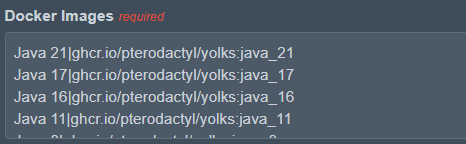
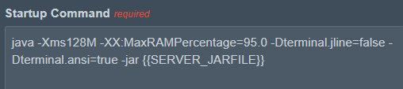

## Eggs

Now Lets's make eggs

Head over to /storage/eggs.json

Here you can add custom eggs

1) Change id to your egg id in pterodactyl panel

2) Change name to your egg name 

3) Enter description

4) Change docker_image to link in egg on pterodactyl panel

5) Then change startup command to the command of egg in pterodactyl panel

6) Change other settings also